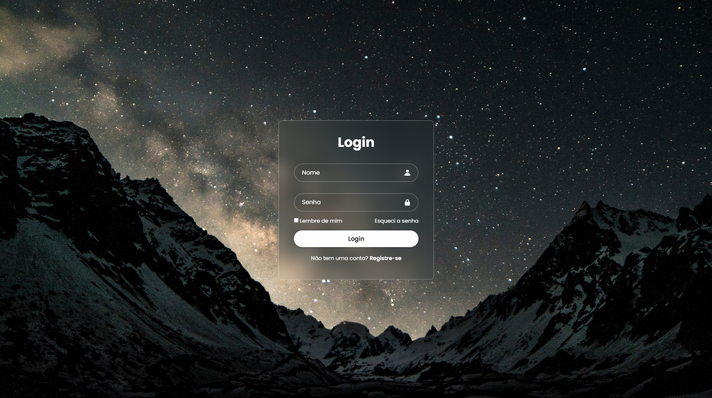

# Login Page

Este é um projeto de uma página de login responsiva, projetada para oferecer uma interface limpa e moderna. O layout utiliza CSS e HTML para criar uma experiência de usuário amigável.

## Demonstração



## Tecnologias Utilizadas

- **HTML**: Estrutura da página
- **CSS**: Estilo e layout da página
- **Google Fonts**: Fonte "Poppins"
- **Boxicons**: Ícones para os campos de entrada

## Instalação

1. Clone o repositório:
   ```bash
   git clone https://github.com/rodriigues11/login.git
   ```

2. Navegue até o diretório do projeto:
   ```bash
   cd login
   ```

3. Abra o arquivo `index.html` no seu navegador para visualizar a página de login.

## Uso

- O formulário inclui campos para nome e senha.
- A página possui uma opção para lembrar o usuário e um link para recuperação de senha.
- Há também um link para registro caso o usuário ainda não tenha uma conta.

## Estrutura de Arquivos

- `index.html`: Arquivo HTML principal
- `css/style.css`: Arquivo CSS para estilos
- `imgs/`: Pasta contendo imagens usadas no projeto

## Contribuições

Sinta-se à vontade para fazer um fork deste repositório e enviar pull requests com melhorias ou correções. 

## Licença

Este projeto está licenciado sob a licença MIT. Veja o arquivo [LICENSE](./LICENSE) para mais detalhes.
